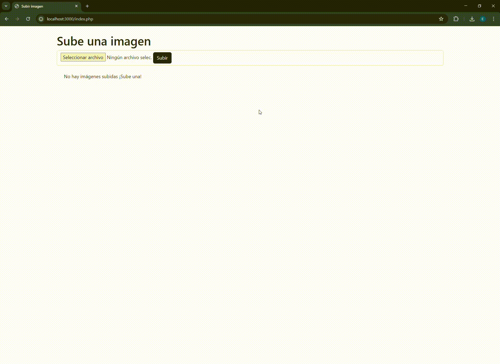

   

 

  

Este código te permite subir una imagen al servidor y a tu base de datos

(lo que se sube a la bbdd es la url de la imagen)

luego recupera la url y muestra la imagen en la interfaz.

De esta forma no cargamos la bd con archivos pesados

    

 

  <h3  align="center">
    <pre>💻Hecho con PHP🐘 y 💝 </pre>
  <h3/>

[  <a href="https://www.linkedin.com/in/emmily-santos-a6851327b?utm_source=share&utm_campaign=share_via&utm_content=profile&utm_medium=android_app">Linkedin</a>
](https://emmilyportfoliosantos.000webhostapp.com/portfolio/index.php) 
